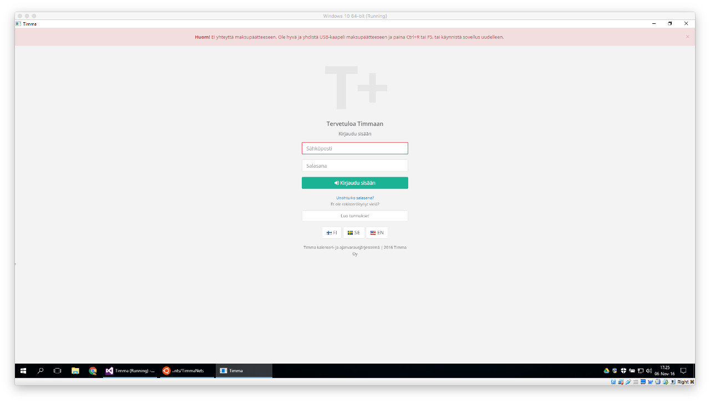

The error dialog above means that Timma has not been able to establish a connection with the terminal. To fix this issue, try the following...

* Reconnect the USB cable to the computer and hit refresh on the application window (Ctrl+R or F5)
* If this doesn't help, restart the Timma application.

If neither of the above approaches work, you will need to verify the USB port settings:

1. Close the Timma application, but make sure the payment terminal is still connected to the computer via USB
2. Open the Windows **Device Manager** via the **Start Menu**
3. You should see a device called `Sagem Telium Comm Port` under `Ports (COM & LPT)`
  * If the customer is running Timma on a Mac (= inside a Virtual Machine) make sure the USB connection is shared from the host machine: `Devices` -> `USB` -> `Sagem` (via the Mac menu bar)
4. Open the device `Properties` dialog by double-clicking on the device
5. Under the `Force COM port` tab you should have the `Force COM Port Feature enabled` checked & the `Force COM port` set to `9` as shown [here](../assets/images/com-port-settings.png)
6. Under the `Port Settings` -> `Advanced...` the `COM Port Number` should be set to `COM9`
7. After verifying/changing these settings, click `OK` and reconnect the USB for them to take effect
8. Launch the Timma application to see if the USB connection can be established.

If this doesn't help either, try restarting the computer and/or reinstalling Timma.
